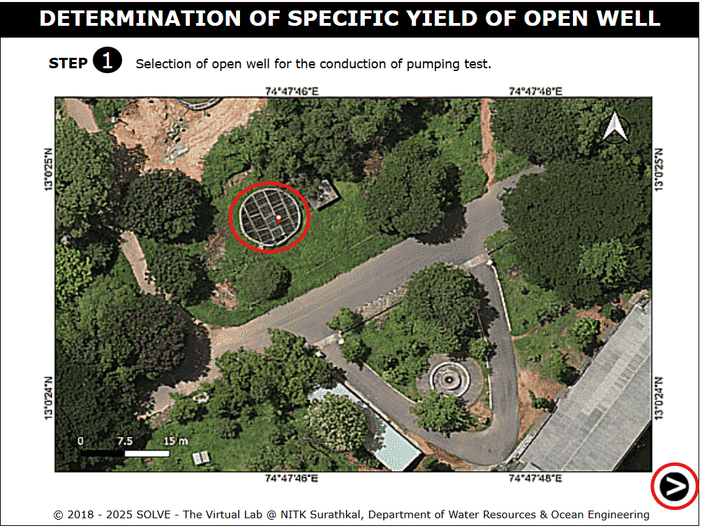
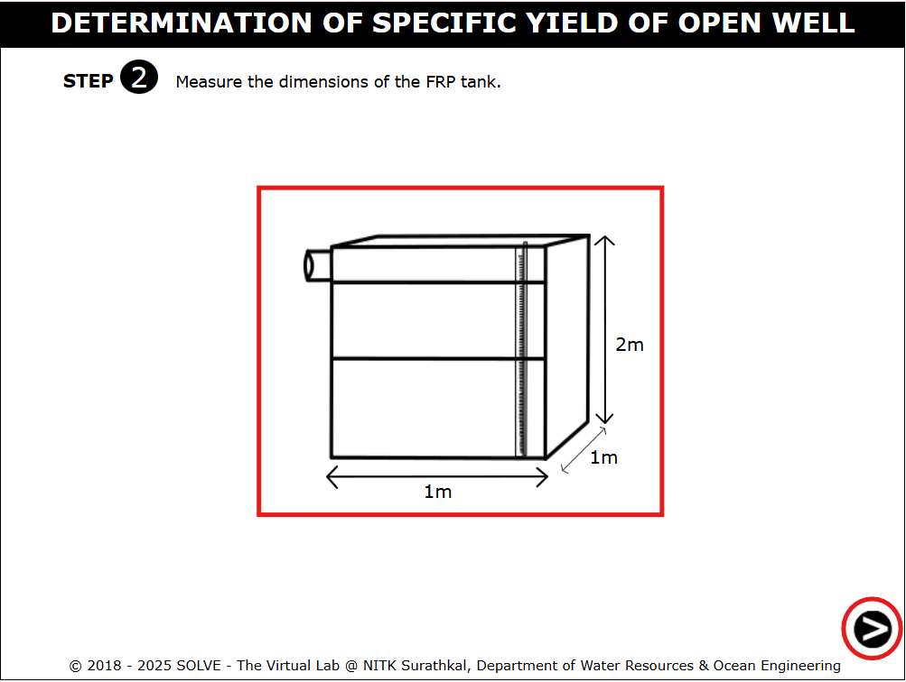
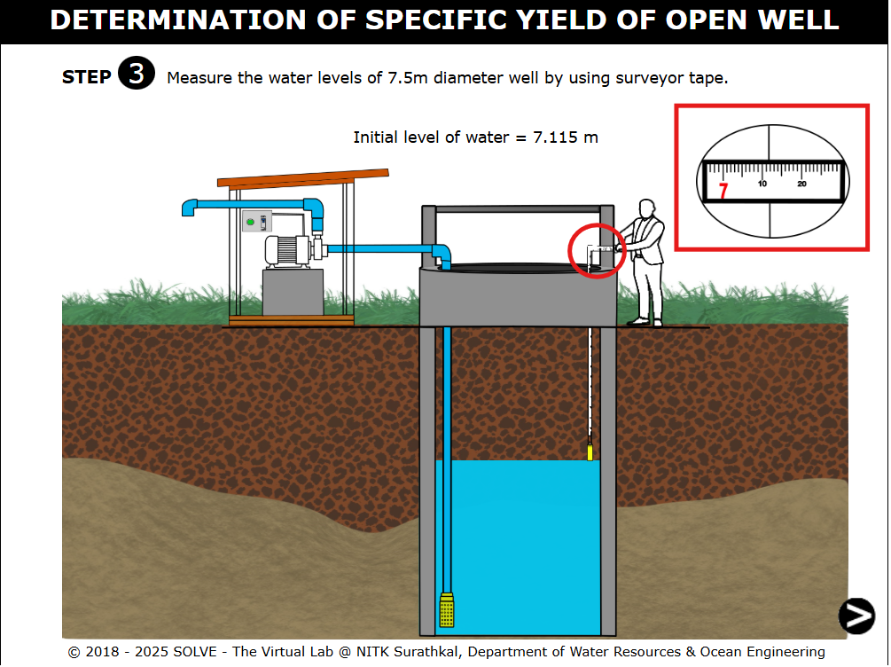
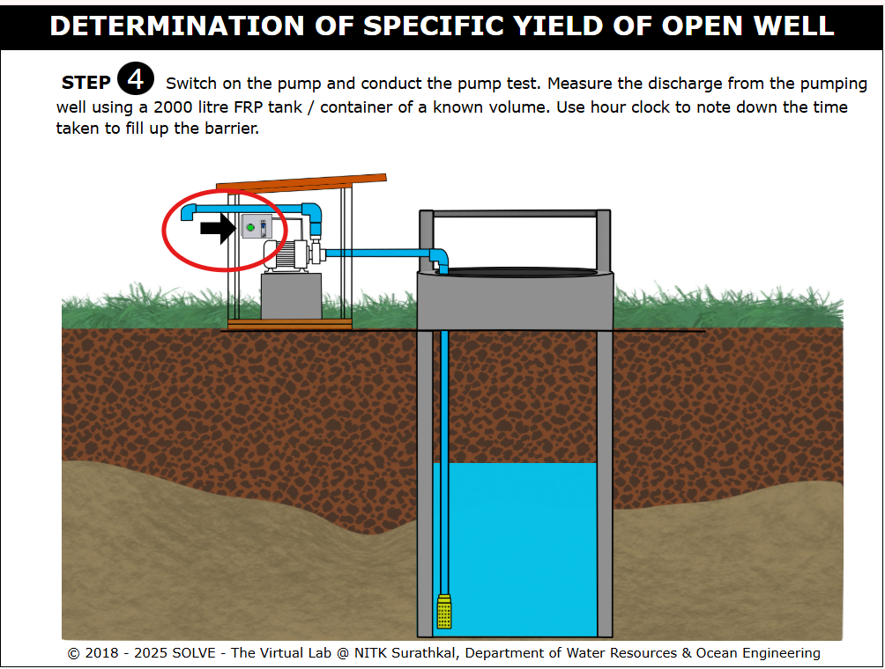
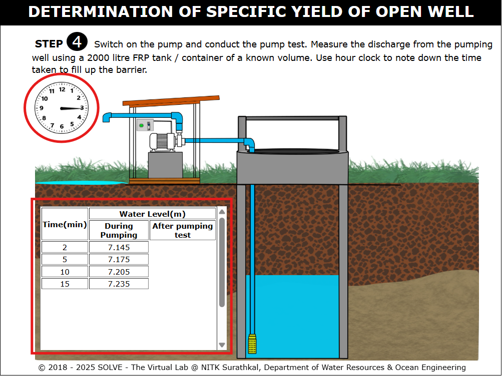
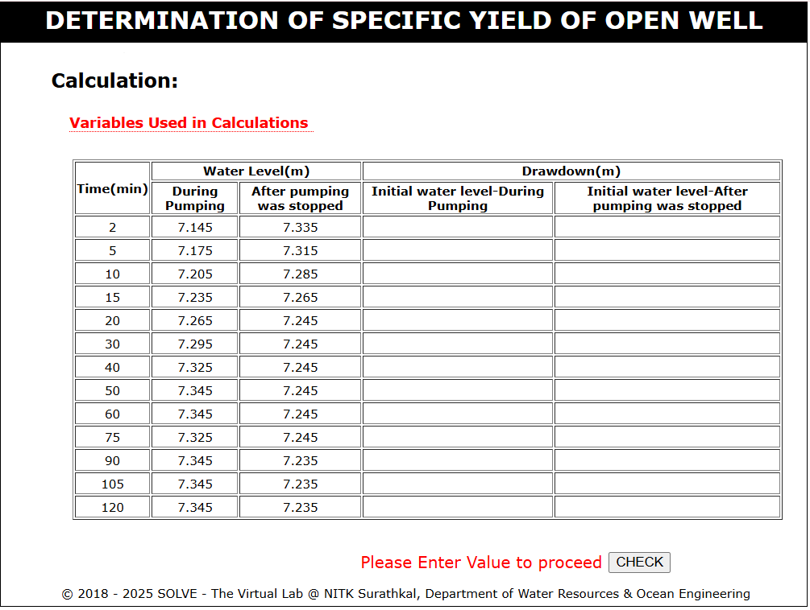

1. Click on the simulation tab of this experiment. The following window will be displayed. 
   

2. Place the cursor over description, the basic definition of experiment will be displayed. Click on the next button to proceed with the experiment. 
   

3. Select the open well for conducting the pumping test and click on "Next button" to move to next step. 
   

4. Measure the dimensions of the FRP tank and click on "Next button" to move to next step. 
   

5. Click on the surveyor tape to measure the water level. 
   

6. Click on the "On" button to switch on the pump to conduct pump test. 
   

7. Measure the discharge from the pumping well and note down the time taken to fill up the barrier. 
   

8. Calculate the initial water level during pumping and initial water level after pumping was stopped for different time interval. Then enter the values in appropriate input field provided and click on "CHECK" button to evaluate the values. 
   
