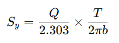

### INTRODUCTION

The determination of the specific yield of an open well using the pump test method involves evaluating the characteristics of the well and the surrounding aquifer. Specific yield is defined as the volume of water released from an aquifer per unit surface area per unit decline in the water table. It is expressed as a fraction or percentage and represents the effective porosity and the ability of the aquifer to release water.

Specific yield is influenced by factors such as the grain size of the aquifer material, the thickness of the aquifer, and the degree of saturation.

To estimate the specific yield using the pump test method, the following general steps are followed:

##### 1. Conducting the Pump Test

- A pump is installed in the well, and water is withdrawn at a constant discharge rate.
- The drawdown (i.e., the decrease in water level) is measured at regular time intervals during the test.
- The discharge rate (Q) of the pump is recorded.

##### 2. Data Analysis

- A drawdown versus time curve is plotted to study the response of the aquifer to pumping.
- The data are analyzed using appropriate methods:
    - Theis method or Cooper–Jacob method for unconfined aquifers
    - Hantush–Jacob method for partially confined aquifers
- These methods are used to determine the hydraulic properties of the aquifer.

An important parameter to be estimated from the analysis is the transmissivity (T) of the aquifer, which indicates its capacity to transmit water.

#### Calculation and Interpretation of Specific Yield

1. Calculation of Specific Yield (Sy)

The specific yield can be estimated using the following expression:

&nbsp;&nbsp;&nbsp;&nbsp;&nbsp;Where, 
&nbsp;&nbsp;&nbsp;&nbsp;&nbsp;&nbsp;&nbsp;&nbsp;&nbsp;&nbsp;&nbsp;&nbsp;&nbsp;&nbsp;&nbsp;&nbsp;Q = Discharge rate of the pump (L³/T), 
&nbsp;&nbsp;&nbsp;&nbsp;&nbsp;&nbsp;&nbsp;&nbsp;&nbsp;&nbsp;&nbsp;&nbsp;&nbsp;&nbsp;&nbsp;&nbsp;T = Transmissivity of the aquifer (L²/T), 
&nbsp;&nbsp;&nbsp;&nbsp;&nbsp;&nbsp;&nbsp;&nbsp;&nbsp;&nbsp;&nbsp;&nbsp;&nbsp;&nbsp;&nbsp;&nbsp;b = Thickness of the saturated aquifer (L)

2. Interpretation of Results

The value of specific yield obtained represents the portion of the aquifer storage that is available for discharge.

3. Consideration of Field Conditions

It should be noted that specific yield may vary under actual field conditions; therefore, the value obtained from this method is an approximation.

4. Remarks on Results

Determination of specific yield is inherently approximate, as field conditions are often complex. The value of specific yield may vary over time due to changes in the water table, well conditions, and other influencing factors. Hence, it is important to conduct the pump test carefully and account for local geological and hydrogeological conditions. For more accurate assessments, consultation with a hydrogeologist or groundwater expert is recommended.
